# SpaceTime GPUSkin（`com.spacetime.gpuskin`）

面向 **Unity** 的 GPU 蒙皮与大批量角色渲染方案：将动画数据烘焙到贴图，在 Shader 中采样；配合 **GPU Instancing** 与 **全局帧** 减少 CPU 与 Draw Call 开销。适用于需要同屏大量独立播放动画的角色的场景。

| 项 | 说明 |
| --- | --- |
| **包名** | `com.spacetime.gpuskin` |
| **Unity** | 2020.3 及以上（见 `package.json`） |
| **命名空间** | `ST.GPUSkin` |
| **文档配图** | 位于本包下 `tex/`，文件名见 [§5 配图文件](#配图文件)（仅供文档展示，不通过 `Resources` 在运行时加载） |

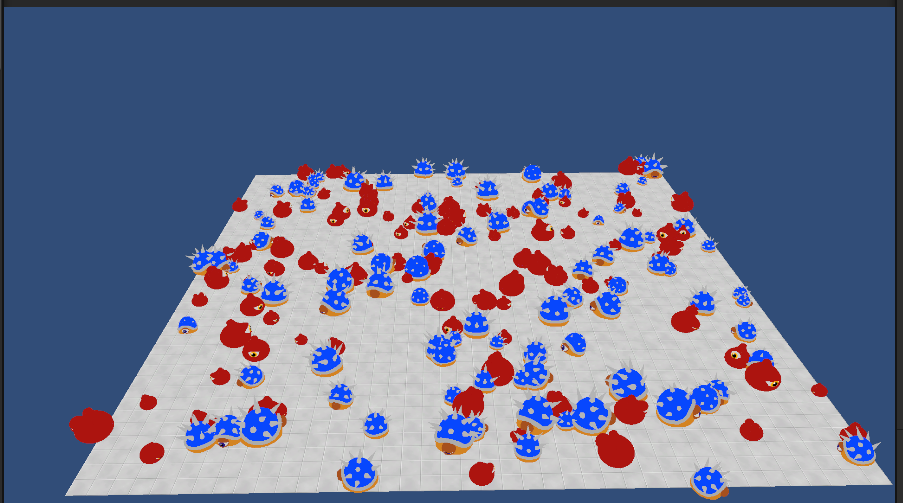

## 目录

- [安装](#安装)
- [1. 动画烘焙到贴图](#1-动画烘焙到贴图)  
  - [1.1 骨骼数据烘焙](#11-骨骼数据烘焙)  
  - [1.2 顶点动画烘焙](#12-顶点动画烘焙)  
  - [1.3 骨骼烘焙 vs 顶点烘焙](#13-骨骼烘焙-vs-顶点烘焙)  
  - [1.4 烘焙带来的性能优势](#14-烘焙带来的性能优势)  
- [2. 材质与 GPU Instancing](#2-材质与-gpu-instancing)  
- [3. 脚本与全局帧](#3-脚本与全局帧)  
- [4. 总结](#4-总结)  
- [5. 包内目录](#5-包内目录)  
  - [配图文件](#配图文件)

---

## 安装

在 **Unity** 项目的 `Packages/manifest.json` 中，于 `dependencies` 增加对本包的引用（将路径改为你本机或仓库中的包目录）：

```json
"com.spacetime.gpuskin": "file:../path/to/Packages/com.spacetime.gpuskin"
```

若通过 **UPM 的 Git URL** 或 **嵌入 Packages 目录** 的方式引入，保持包根目录下存在本 `package.json` 与 `Runtime` / `Editor` 等文件夹即可。导入后，**骨骼 / 顶点烘焙** 使用 `Editor` 菜单与 `GPUSkinBoneTool`、`GPUSkinVertexTool` 等；**运行时** 在场景对象上挂载 `GPUSkinBonePlayer` 或 `GPUSkinVertexPlayer` 等组件。

---

## 1. 动画烘焙到贴图

通过 `Animator` 的 `StartRecording` / `StopRecording` 可以按帧记录动画。默认 **30 FPS**（例如 1 秒动画约 30 帧数据）。记录结果写入贴图，Shader 按「动画偏移、帧索引、骨骼或顶点索引」采样，得到当前帧变形数据，从而 **不再依赖每角色 `Animator.Update`**。

### 1.1 骨骼数据烘焙

对每一帧、每一根骨骼，读取其 **4×4 矩阵**，按行顺序写入贴图：每个像素 **RGBA 四个通道存矩阵的一行**，故 **一根骨骼占 4 个连续像素**。

结构示意：

```text
frame1:
  bone1: (m00~m03) (m10~m13) (m20~m23) (m30~m33)  // 4 个像素
  bone2: ...
frame2:
  ...
```

多段动画时，用 **配置数据** 记录每段动画在贴图中的起始像素；下一段从该位置继续排布即可。

| 内容 | 图示 |
| --- | --- |
| 骨骼数据贴图示例 | 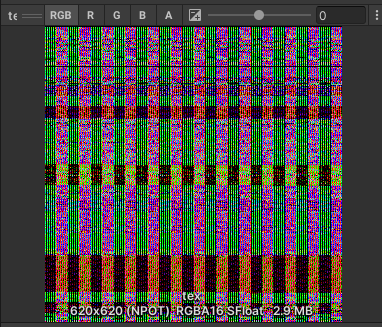 |
| 配置数据示例 | 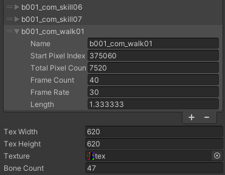 |

**使用方式要点：**

1. **Mesh**：`uv2` 存骨骼索引，`uv3` 存权重。  
2. **Shader**：根据「当前动画像素偏移 + 当前帧 + 骨骼索引」从贴图取矩阵。若顶点受最多 4 根骨骼影响，则按标准蒙皮：  
   `matrix1*weight1 + matrix2*weight2 + matrix3*weight3 + matrix4*weight4`  
   得到本地空间顶点位置。  
3. **着色器资产**：`Shaders/GPUSkin/GPUSkinBone.shader` 及同目录 HLSL 包含文件。

### 1.2 顶点动画烘焙

对每一帧记录 **模型顶点位置**，按顺序写入贴图。每个像素用 **RGB 三通道** 即可存一个顶点坐标。

```text
frame1:  vertex1, vertex2, ...
frame2:  ...
```

多动画同样用配置表记录各段在贴图中的起止位置。

| 内容 | 图示 |
| --- | --- |
| 顶点数据贴图 | 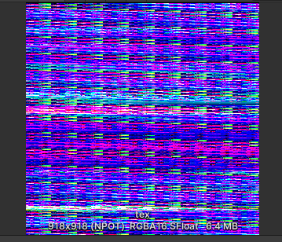 |
| 配置数据 | 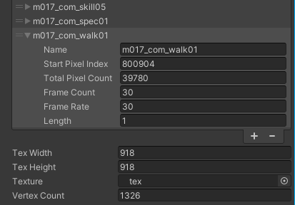 |

**Shader 侧**：用「当前动画像素偏移、当前帧索引、顶点索引」直接采样得到该帧顶点位置，流程比骨骼方案更直观、计算更少。对应着色器资产：`Shaders/GPUSkin/GPUSkinVertex.shader` 及同目录 HLSL。

### 1.3 骨骼烘焙 vs 顶点烘焙

| 对比项 | 骨骼烘焙 | 顶点烘焙 |
| --- | --- | --- |
| 贴图占用 | 相对较小 | 相对较大（逐顶点存位置） |
| Shader 复杂度 | 需采样骨骼矩阵并做蒙皮加权和 | 多仅为顶点位置采样，计算更轻 |
| 对 Mesh 的要求 | 需写入骨骼索引与权重等 | 可使用更接近原始资产的工作流 |

**何时优先考虑顶点烘焙**：顶点数有上限、动画总时长较短时（例如约 1500 顶点级），贴图内存可控，顶点烘焙在 Shader 与实现上往往更简单。

### 1.4 烘焙带来的性能优势

动画结果预先落在贴图里，运行时只需在 Shader 中查表，**避免大量 `Animator` 的 CPU 骨骼解算**；在大量同屏单位时，能明显降低 CPU 动画相关耗时。

---

## 2. 材质与 GPU Instancing

Unity 的 **GPU Instancing** 可将大量同材质、同 Mesh 的物体合并为少量 Draw Call。

1. **材质**：在材质上勾选 **Enable GPU Instancing**。  
2. **Shader**：对逐实例变化量使用 `UNITY_INSTANCING_BUFFER_START(Props)` / `UNITY_INSTANCING_BUFFER_END(Props)` 包裹，并用 `UNITY_ACCESS_INSTANCED_PROP` 读取。  

   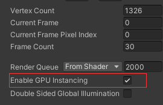  
   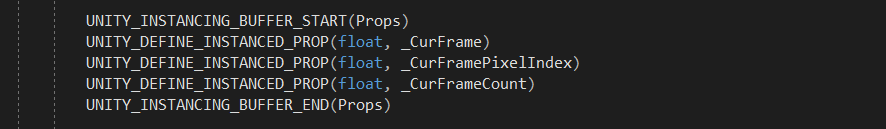  
   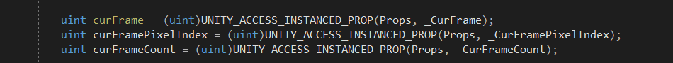  

3. **脚本**：通过 `MaterialPropertyBlock` 为每个实例设置不同参数（而仍共用同一材质）。  

   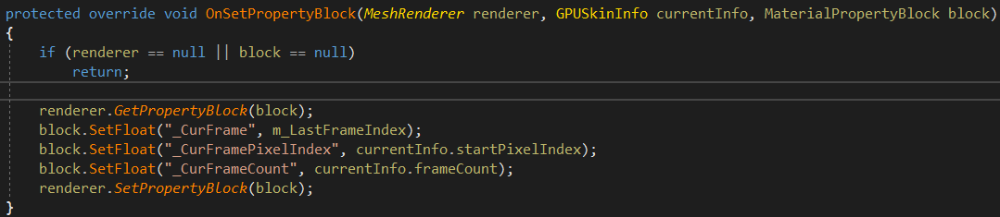  

**示例效果**：约 200 个测试 NPC 时 Draw Call 可压到个位数（如示例中约 3），显著减轻 CPU 批处理与 GPU 状态切换压力。  

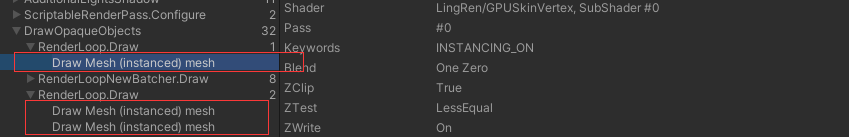

---

## 3. 脚本与全局帧

在部分机型上（如测试用的 Galaxy S8），大量 NPC 时若每实例在 `Update` 里推进动画帧，**单帧可占用数毫秒级 CPU**。

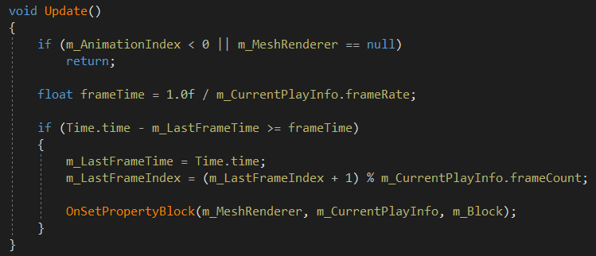  
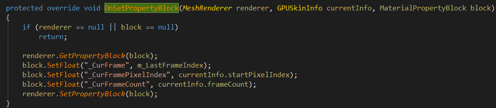  

**思路**：仅在需要切换/设置动画时改材质或 PropertyBlock 参数，**不再每帧在脚本里推帧**；由 **`GPUSkinMgr` 单例** 按 **30 FPS** 刷新 Shader 全局属性 `g_GpuSkinFrameIndex`（见 `Shader.SetGlobalInt(GPUSkinDefine.GPUSKIN_SHADER_COMMON_GLOBAL_FRAME_INDEX_ID, …)`，仅在定义了 `ST_GAME_MODE` 时参与相关编译/调用路径），在 Shader 侧用该全局帧推进时间轴，统一驱动多实例。

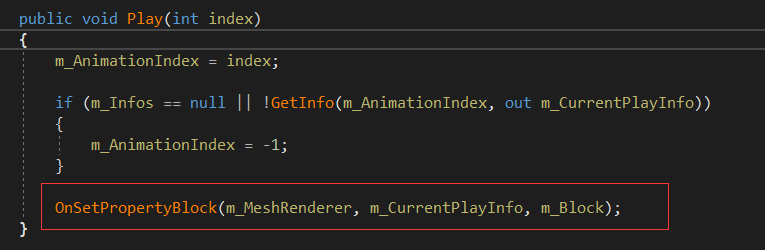  
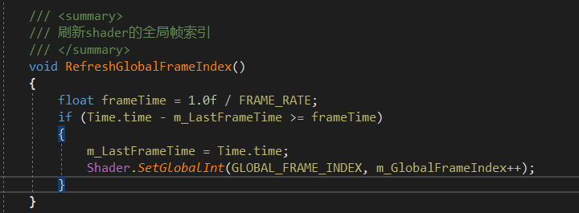  
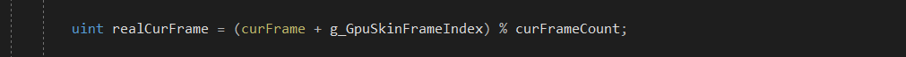  

这样可避免「数百实例 × 每帧脚本逻辑」的放大效应。

---

## 4. 总结

| 方面 | 说明 |
| --- | --- |
| **动画** | 烘焙到贴图后，以采样代替运行时骨骼解算，主要增加显存中的贴图占用。 |
| **合批** | GPU Instancing + 少量 Draw Call 合并渲染大量相同管线角色。 |
| **CPU** | 结合全局帧与去 `Update` 化，避免每单位每帧的脚本与 Animator 压力。 |

整体上，**动画烘焙 + GPU Instancing + 轻量 CPU 侧驱动** 适合同屏多实例、且动画可由「全局/共享时间轴 + 每实例少数参数」表达的场景。若与完整 `Animator` 状态机、复杂 IK/物理混合有强耦合，需单独评估是否适合本方案。

---

## 5. 包内目录

| 路径 | 内容 |
| --- | --- |
| `Runtime/` | 运行时程序集：`ST.GPUSkin`，含 `GPUSkinMgr`、`GPUSkinBonePlayer`、`GPUSkinVertexPlayer`、各 `*InfoDB` 等。 |
| `Editor/` | 烘焙与 Inspector：`Editor/Scripts/Tools`（`GPUSkinBoneTool`、`GPUSkinVertexTool` 等）、`Inspector` 等。 |
| `Shaders/` | `GPUSkinBone`、`GPUSkinVertex` 等 Shader 与 HLSL 公共文件。 |
| `tex/` | 本文 `README` 用配图，文件名见下表（与包根 `README.md` 相对路径一致）。 |

### 配图文件

| 文件 | 对应章节与内容 |
| --- | --- |
| `overview.png` | 文首总览。 |
| `bone-matrix-baked-texture.png` | §1.1 骨骼矩阵烘焙结果贴图示例。 |
| `bone-clip-segment-config.png` | §1.1 多段动画在贴图中的起止/片段配置。 |
| `vertex-position-baked-texture.png` | §1.2 顶点位置烘焙贴图。 |
| `vertex-clip-segment-config.png` | §1.2 顶点方案动画片段配置。 |
| `shader-gpu-instancing-props-1.png` – `shader-gpu-instancing-props-3.png` | §2 Shader 中 `UNITY_INSTANCING_BUFFER` 与 `UNITY_ACCESS_INSTANCED_PROP` 示例（三张截图）。 |
| `script-material-property-block.png` | §2 脚本中 `MaterialPropertyBlock` 设置。 |
| `frame-debugger-batched-npcs.png` | §2 多 NPC 合批后 Draw Call 统计示例。 |
| `profiler-npc-anim-update-1.png` – `profiler-npc-anim-update-2.png` | §3 Profiler 中 NPC 动画相关 `Update` 耗时。 |
| `refactor-gpuskinplayer-no-update.png` | §3 去掉逐实例 `Update` 后的脚本结构。 |
| `code-gpuskinmgr-global-frame-index.png` | §3 `GPUSkinMgr` 中刷新全局帧索引。 |
| `shader-gpuskin-global-frame-index.png` | §3 Shader 中使用的全局帧（如 `g_GpuSkinFrameIndex` 相关逻辑）。 |
